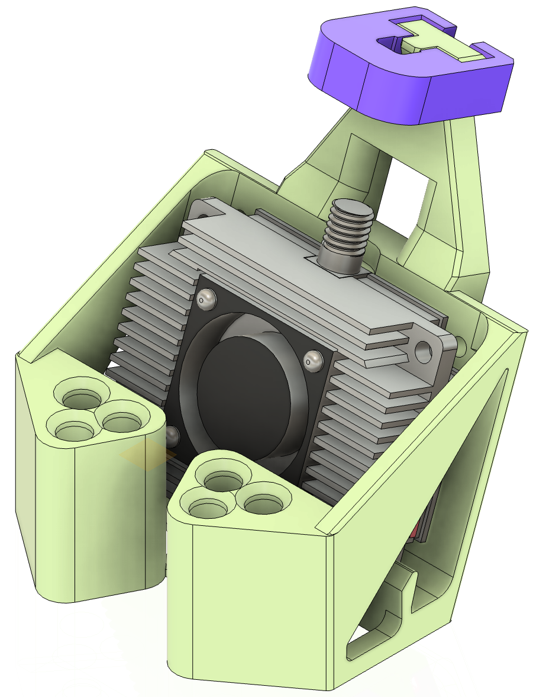
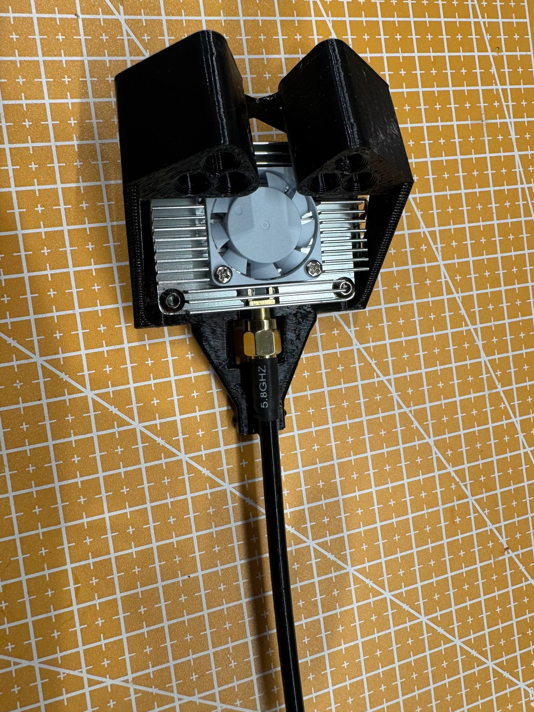
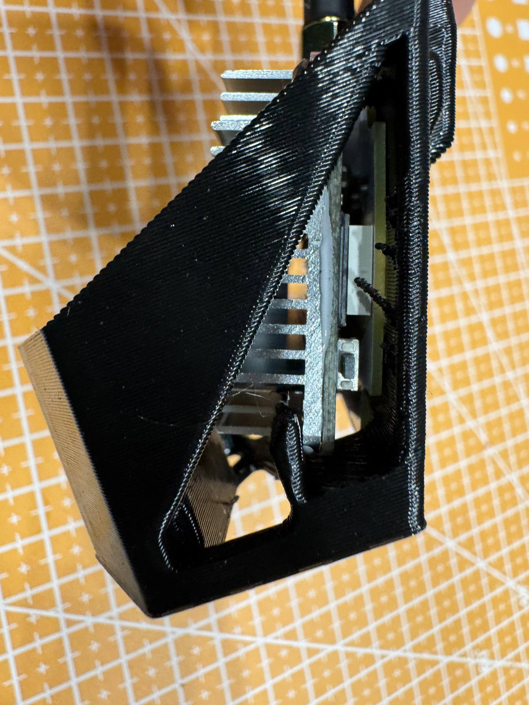
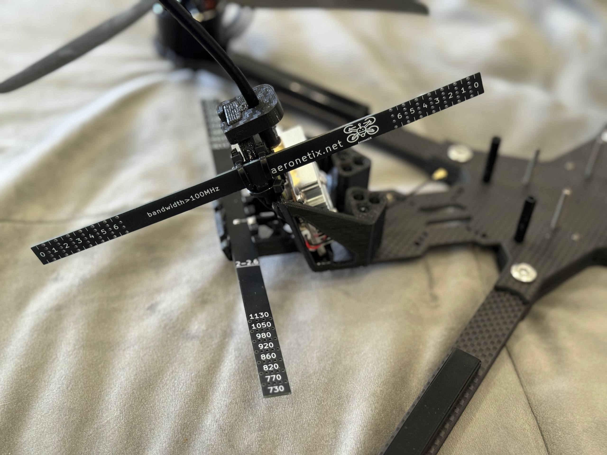
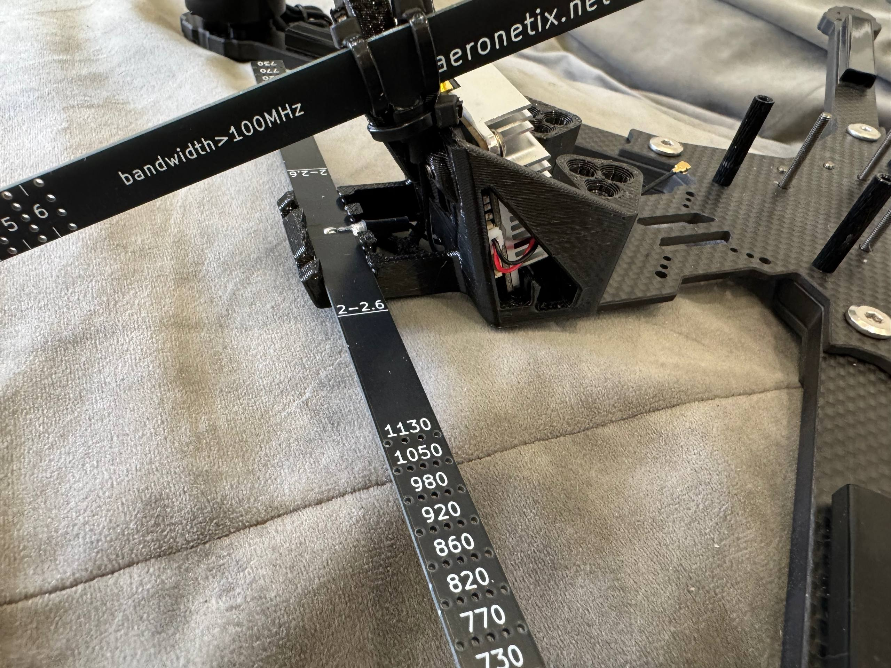
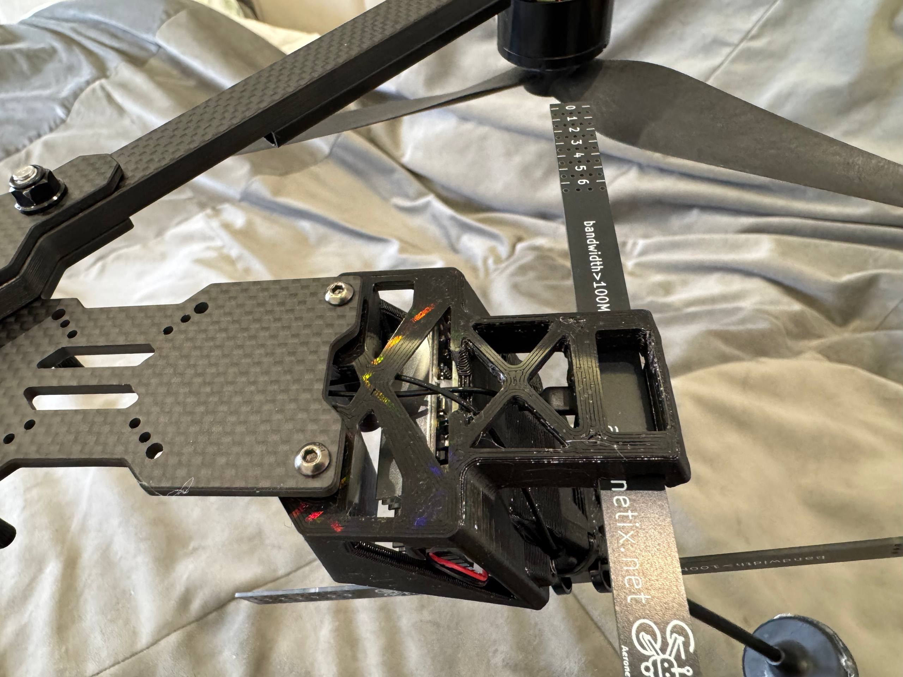

# 🍩🍩🍩 [DONATE](https://send.monobank.ua/jar/8GPxyGjM8E) 🍩🍩🍩

‼️ Моделі не для продажу! Заборонено комерційне використання кріплень. Автор не несе відповідальності за використання моделей ‼️

Маунт кріплення VTX Peakfpv THOR T35/T67 без пігтейлу з підтримкою антени.

[Кріплення універсальне. ⌀ 5mm](thor_mount_universal_5mm.stl)

[Кріплення універсальне. ⌀ 6mm](thor_mount_universal_6mm.stl)

[Фіксатор антени](sma_fixture.stl). Рекомендую друкувати його з PETG пластику.

Підтримувані рами:

- Manta 10
- XL10V7. Потрібен [спейсер 5mm](xl10v7_spacer_5mm.stl) OR [спейсер 6mm](xl10v7_spacer_5mm.stl)
- Mark4V2. Потрібен [спейсер 5mm](mark4v2_spacer_5mm.stl) OR [спейсер 6mm](mark4v2_spacer_6mm.stl)

