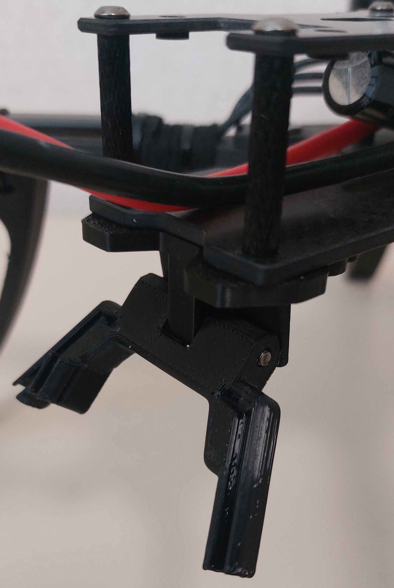

# 🍩🍩🍩 [DONATE](https://send.monobank.ua/jar/8GPxyGjM8E) 🍩🍩🍩

‼️ Моделі не для продажу! Заборонено комерційне використання кріплень. Автор не несе відповідальності за використання моделей ‼️

---

## Моделі складних кріплень антен V0.3

Для збірки потрібен гвинт M3x30 (наприклад від стеку speedybee)

---

### DJI video antennas mount

__Note:__ для використання маунту для O3 Unit використовуйте поворотку [manta10_L_body.V3.stl](/FPV_CAMERA_MOUNT/Povorotna/V3/manta10_L_body.V3.stl)

Варіант назад вниз:

---

### RX Mount

---

### Альтернативно, якщо сзаду немає інших кріплень, можна використати варіант на стійки. Може бути корисний якщо використовується стандартний XT90 розʼєм.

[foldable_back_standoff_ant_mount_base_manta10_v0.3.stl](/FPV_ANT_mount/manta10/v0.3/foldable_back_standoff_ant_mount_base_manta10_v0.3.stl)

