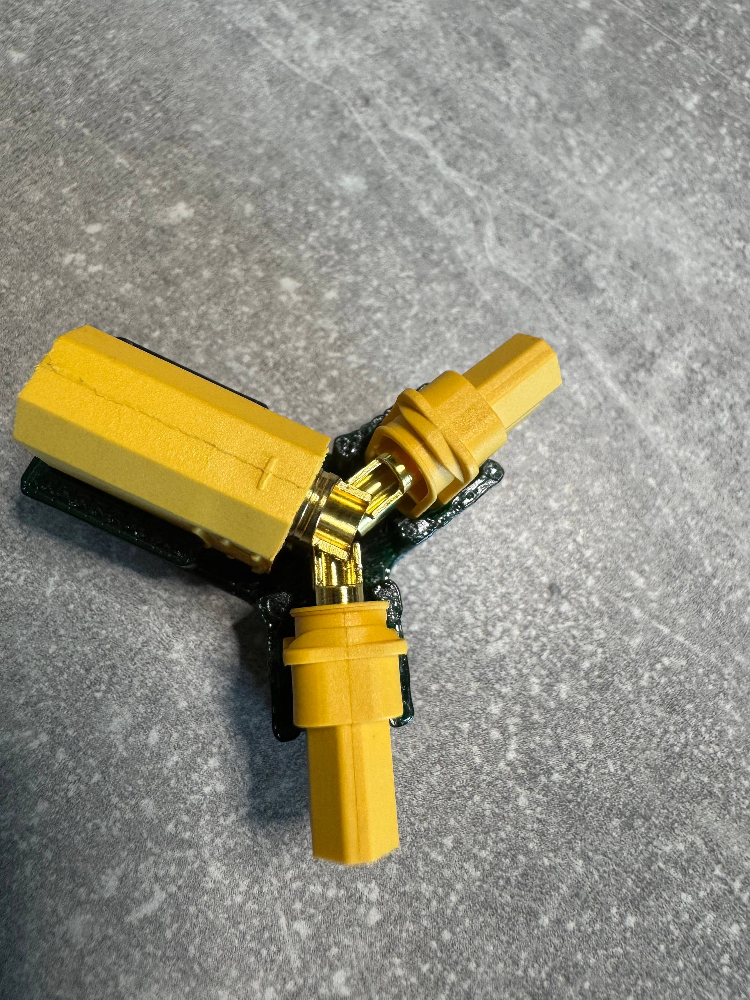
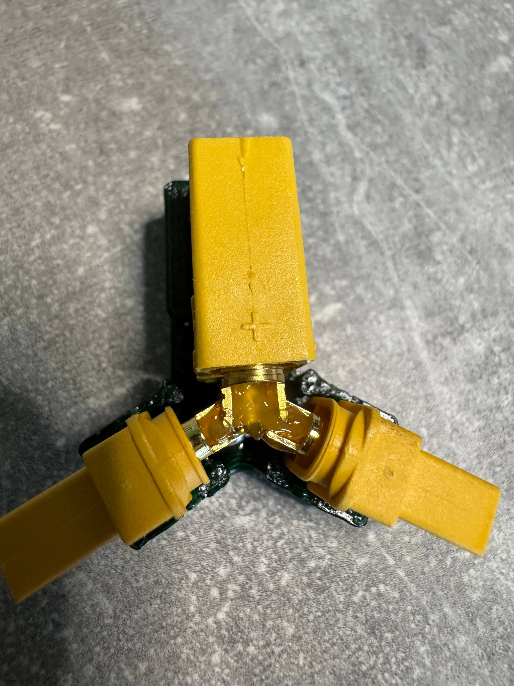
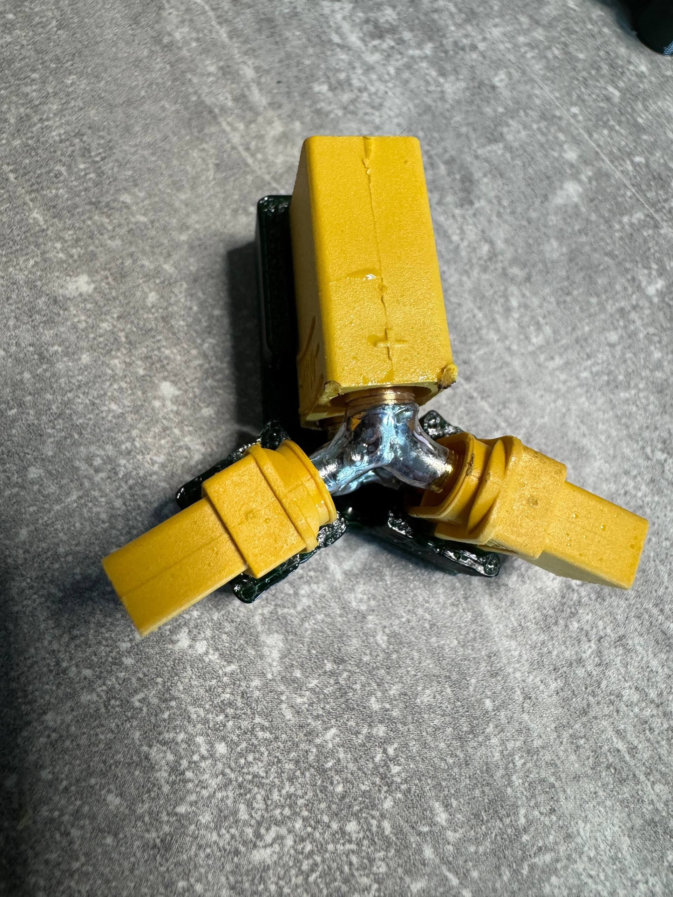
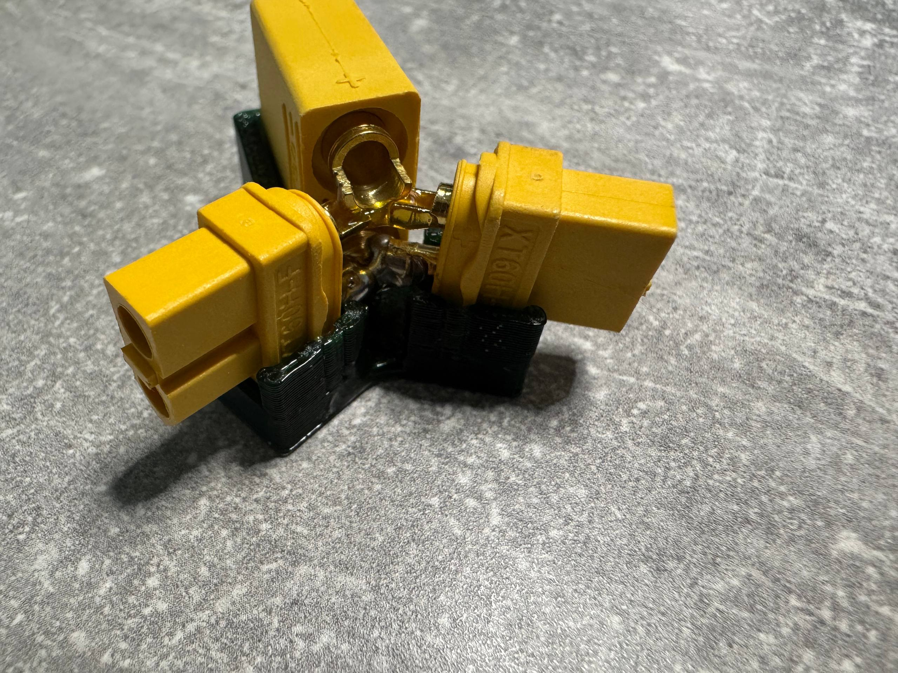
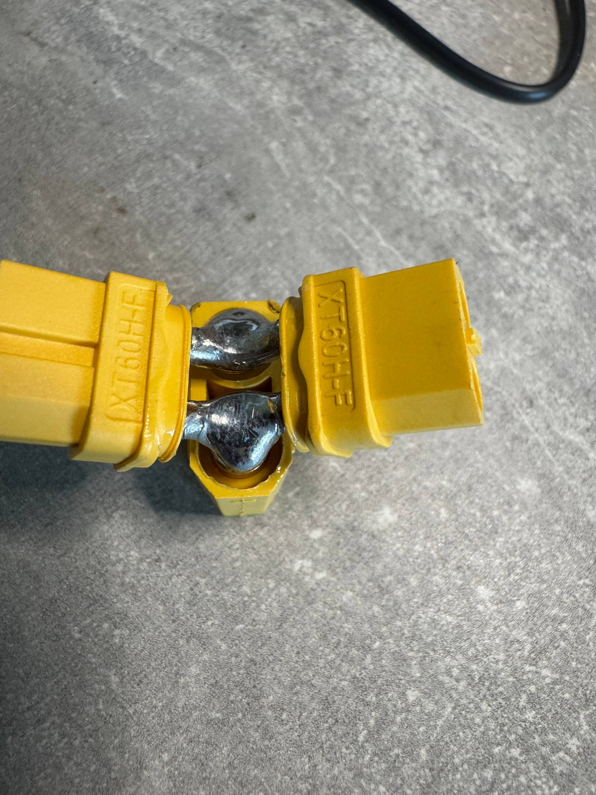
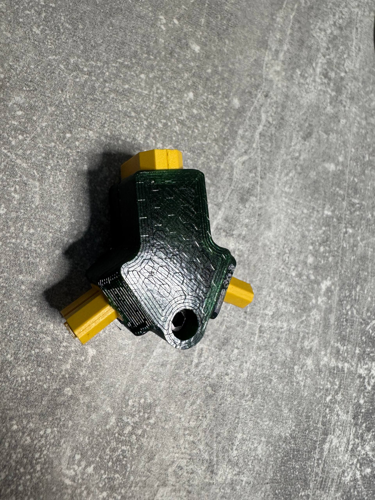
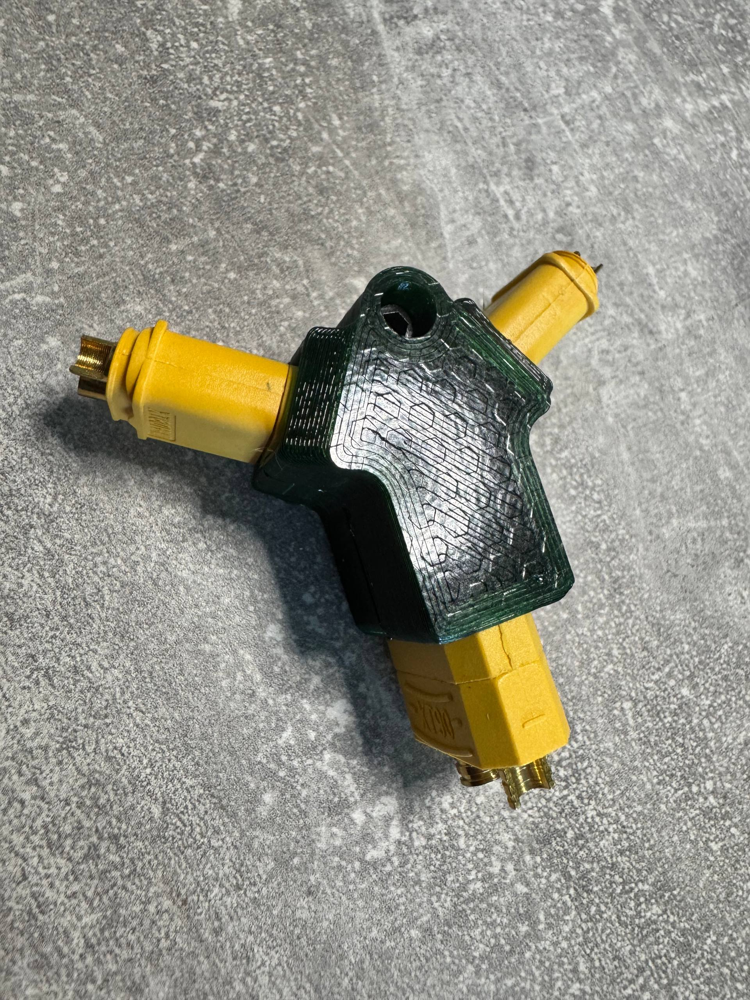

# 🍩🍩🍩 [DONATE](https://send.monobank.ua/jar/8GPxyGjM8E) 🍩🍩🍩

‼️ Моделі не для продажу! Заборонено комерційне використання кріплень. Автор не несе відповідальності за використання моделей ‼️

### 1. Вкладаєм конектори в шаблон

### 2. Наносимо флюс

### 3. Добре запаюєм

### 4. Перевертаєм і повторюєм на іншій стороні

### 5. Поправляєм пайку до однорідного стану, і **ОБОВ₴ЯЗКОВО** перевіряєм на відсутність крапель припою!

### 6. Вставляєм в корпус, притягнути гвинтом M3 8-14mm, і/або можна на герметик.

### 7. Користуємось
