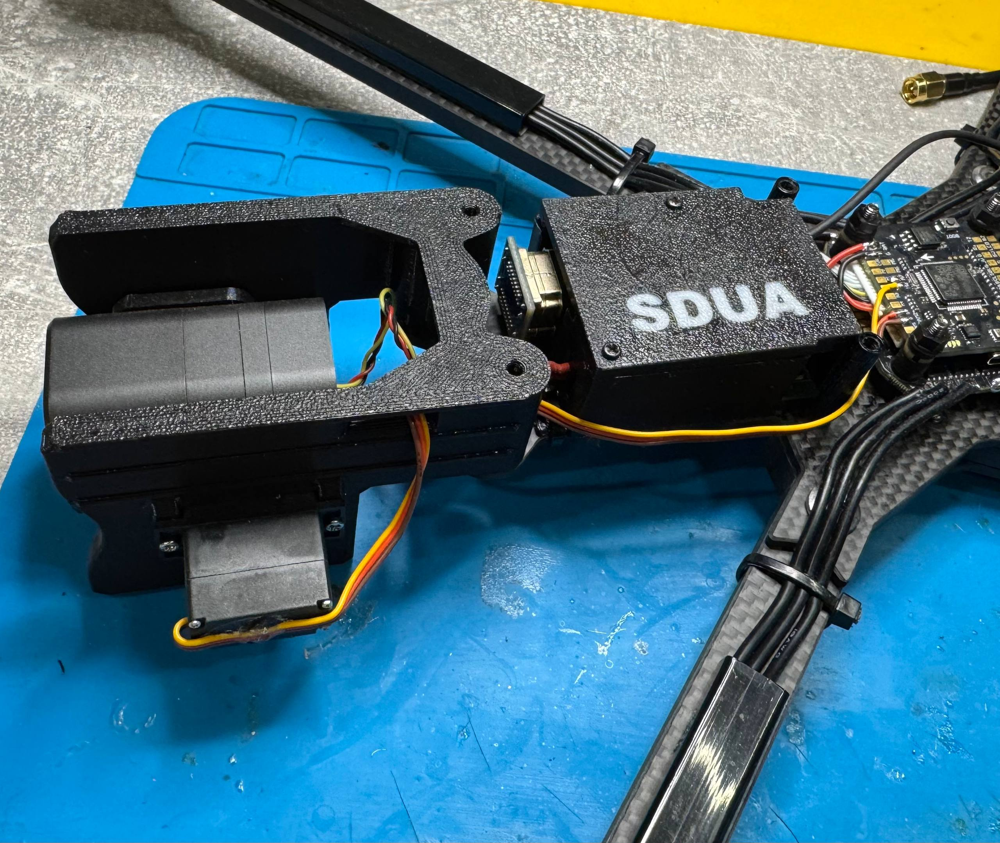
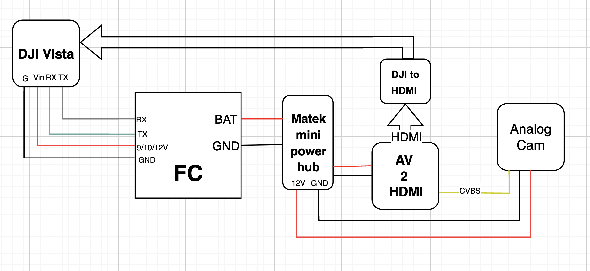
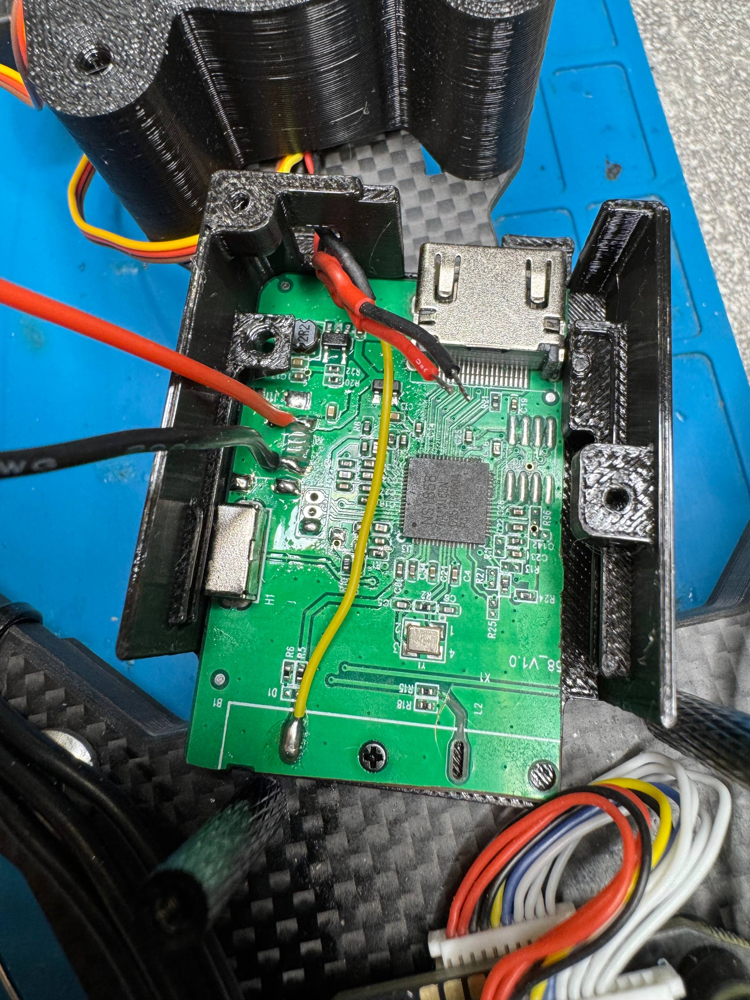
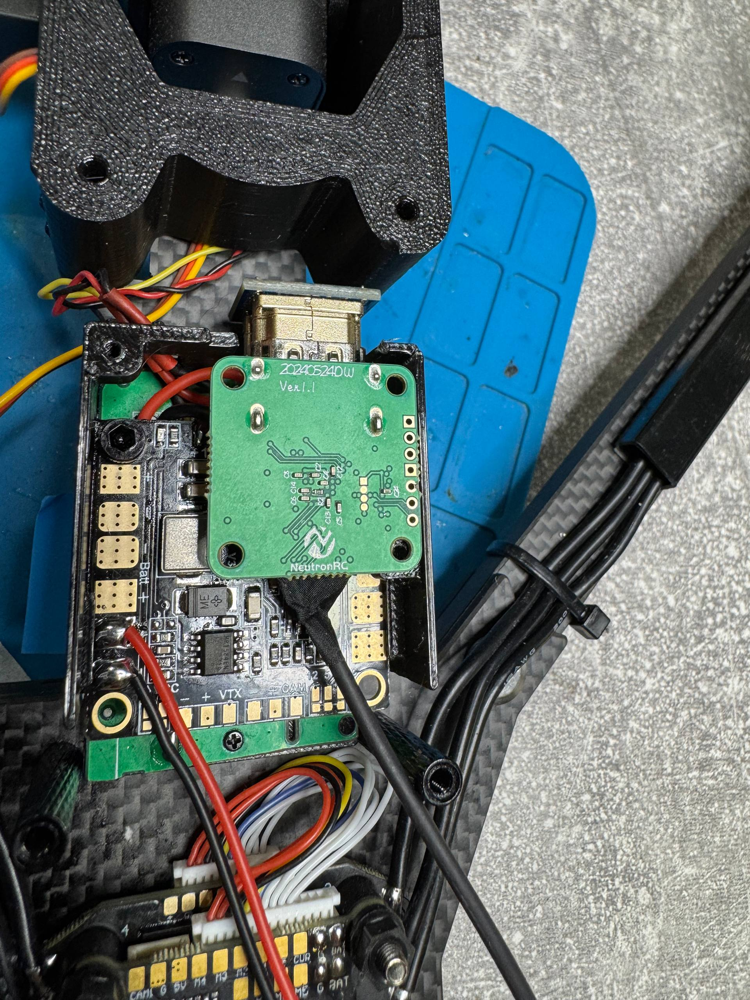
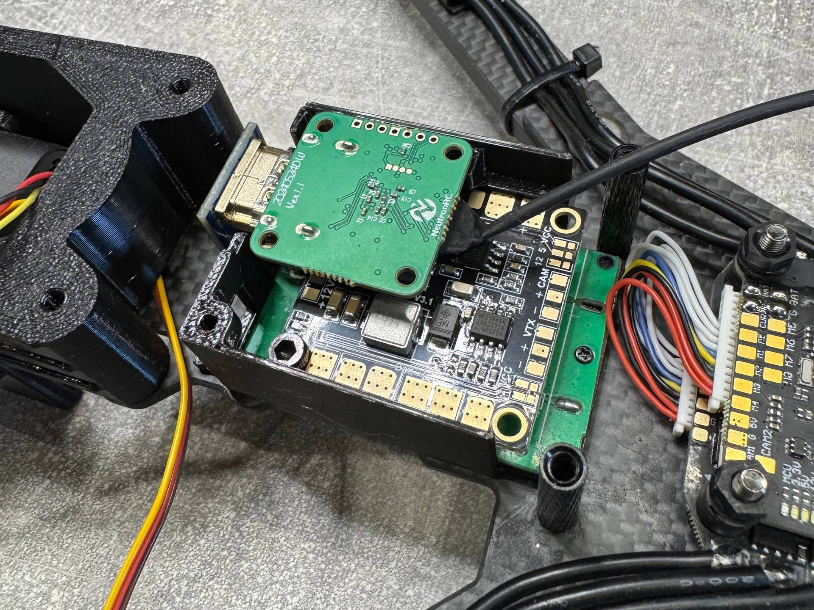

# 🍩🍩🍩 [DONATE](https://send.monobank.ua/jar/2JbpBYkhMv) 🍩🍩🍩

‼️ Моделі не для продажу! Заборонено комерційне використання кріплень. Автор не несе відповідальності за використання моделей ‼️

# Digital Night v1.2

Корпус для електроніки «нічної цифри» на базі **DJI Vista**.

Аналогова нічна камера віддає CVBS, конвертер `AV → HDMI` перетворює його в HDMI, адаптер `DJI to HDMI` заганяє картинку в порт камери DJI Vista. Все це разом з живленням складається в один блок і ставиться на раму перед стеком.

## Деталі

[Корпус](digital_night_body_v1.2.stl). Габарит 40.4 × 58.3 × 20 мм.

[Кришка](digital_night_lid_v1.2.stl)

[Логотип](logo_v1.2.stl). Окрема деталь під паз у кришці (глибина 0.7 мм). Друкувати другим кольором / зі зміною філаменту. Кришка і логотип в одній системі координат — імпортувати «як є», без переміщення.

Крепіж:

- 2 × саморіз M2 — кришка до корпуса (отвори ⌀1.9 мм)
- 1 × M2 через нижній фланець (отвір ⌀1.7 мм) — фіксація блоку на рамі

## Що влазить всередину

Знизу вгору:

1. Плата конвертера `AV → HDMI`
2. `Matek mini power hub` — з нього 12 V на конвертер і на камеру
3. Адаптер `DJI to HDMI`

Вихід HDMI дивиться назовні через виріз в корпусі — шлейф на Vista під'єднується без розбирання блоку.

## Схема підключення

- **DJI Vista**: `Vin` ← 9/10/12 V з польотного контролера, `GND` ← `GND` FC, `RX` ← `TX` FC, `TX` → `RX` FC
- **FC**: `BAT` / `GND` → вхід `Matek mini power hub`
- **Matek mini power hub**: `12V` / `GND` → плата `AV 2 HDMI` і живлення аналогової камери
- **Аналогова камера**: `CVBS` → вхід `AV 2 HDMI`
- **AV 2 HDMI**: `HDMI out` → `HDMI in` адаптера `DJI to HDMI`
- **DJI to HDMI** → порт камери `DJI Vista`

## Збірка

